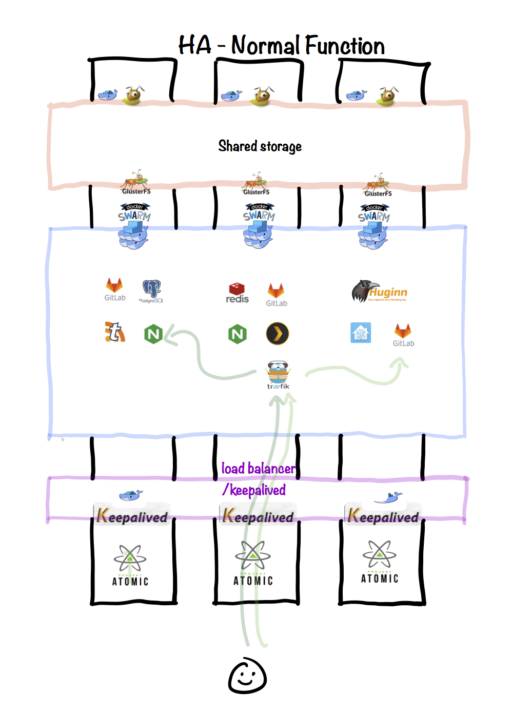
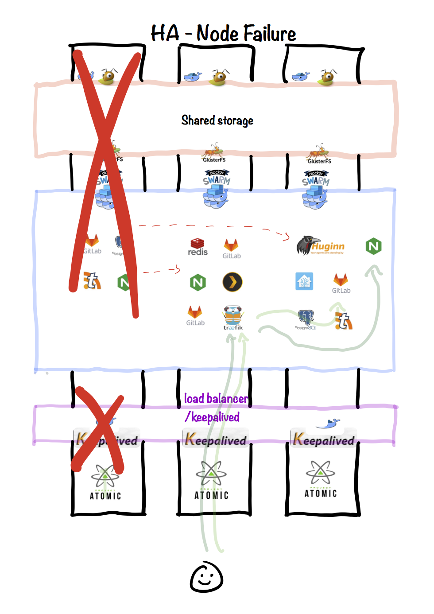
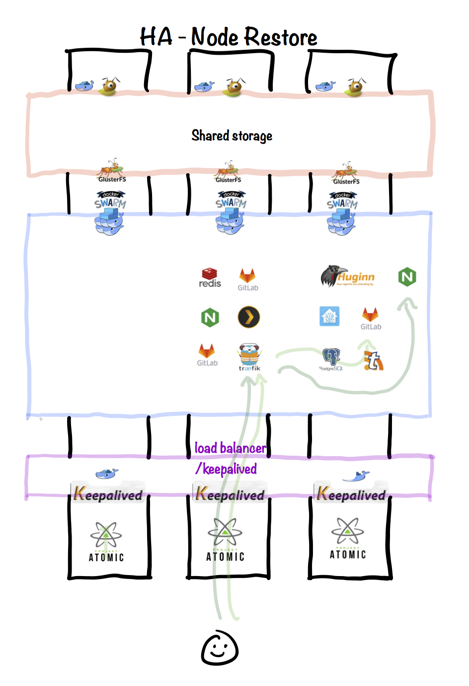

# Design

In the design described below, the "private cloud" platform is:

* **Highly-available** (_can tolerate the failure of a single component_)
* **Scalable** (_can add resource or capacity as required_)
* **Portable** (_run it on your garage server today, run it in AWS tomorrow_)
* **Secure** (_access protected with LetsEncrypt certificates_)
* **Automated** (_requires minimal care and feeding_)

## Design Decisions

**Where possible, services will be highly available.**

This means that:

* At least 3 docker swarm manager nodes are required, to provide fault-tolerance of a single failure.
* GlusterFS is employed for share filesystem, because it too can be made tolerant of a single failure.

**Where multiple solutions to a requirement exist, preference will be given to the most portable solution.**

This means that:

* Services are defined using docker-compose v3 YAML syntax
* Services are portable, meaning a particular stack could be shut down and moved to a new provider with minimal effort.

## Security

Under this design, the only inbound connections we're permitting to our docker swarm are:

### Network Flows

* HTTP (TCP 80) : Redirects to https
* HTTPS (TCP 443) : Serves individual docker containers via SSL-encrypted reverse proxy

### Authentication

* Where the proxied application provides a trusted level of authentication, or where the application requires public exposure,

## High availability

### Normal function

Assuming 3 nodes, under normal circumstances the following is illustrated:

* All 3 nodes provide shared storage via GlusterFS, which is provided by a docker container on each node. (i.e., not running in swarm mode)
* All 3 nodes participate in the Docker Swarm as managers.
* The various containers belonging to the application "stacks" deployed within Docker Swarm are automatically distributed amongst the swarm nodes.
* Persistent storage for the containers is provide via GlusterFS mount.
* The **traefik** service (in swarm mode) receives incoming requests (on http and https), and forwards them to individual containers. Traefik knows the containers names because it's able to access the docker socket.
* All 3 nodes run keepalived, at different priorities. Since traefik is running as a swarm service and listening on TCP 80/443, requests made to the keepalived VIP and arriving at **any** of the swarm nodes will be forwarded to the traefik container (no matter which node it's on), and then onto the target backend.

### Node failure

In the case of a failure (or scheduled maintenance) of one of the nodes, the following is illustrated:

* The failed node no longer participates in GlusterFS, but the remaining nodes provide enough fault-tolerance for the cluster to operate.
* The remaining two nodes in Docker Swarm achieve a quorum and agree that the failed node is to be removed.
* The (possibly new) leader manager node reschedules the containers known to be running on the failed node, onto other nodes.
* The **traefik** service is either restarted or unaffected, and as the backend containers stop/start and change IP, traefik is aware and updates accordingly.
* The keepalived VIP continues to function on the remaining nodes, and docker swarm continues to forward any traffic received on TCP 80/443 to the appropriate node.

### Node restore

When the failed (or upgraded) host is restored to service, the following is illustrated:

* GlusterFS regains full redundancy
* Docker Swarm managers become aware of the recovered node, and will use it for scheduling **new** containers
* Existing containers which were migrated off the node are not migrated backend
* Keepalived VIP regains full redundancy

### Total cluster failure

A day after writing this, my environment suffered a fault whereby all 3 VMs were unexpectedly and simultaneously powered off.

Upon restore, docker failed to start on one of the VMs due to local disk space issue[^1]. However, the other two VMs started, established the swarm, mounted their shared storage, and started up all the containers (services) which were managed by the swarm.

In summary, although I suffered an **unplanned power outage to all of my infrastructure**, followed by a **failure of a third of my hosts**... ==all my platforms are 100% available with **absolutely no manual intervention**==.

[^1]: Since there's no impact to availability, I can fix (or just reinstall) the failed node whenever convenient.

## Chef's Notes

### Tip your waiter (donate) 

Did you receive excellent service? Want to make your waiter happy? (_..and support development of current and future recipes!_) See the [support](/support/) page for (_free or paid)_ ways to say thank you! 

### Your comments? 
