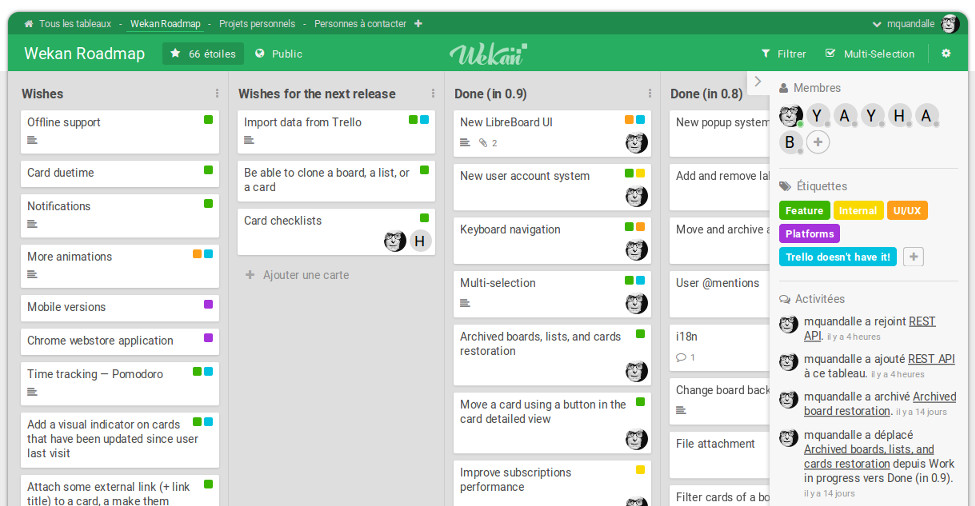

# Load Balancer

One of the issues I encountered early on in migrating my Docker Swarm workloads to Kubernetes on GKE, was how to reliably permit inbound traffic into the cluster.

There were several complications with the "traditional" mechanisms of providing a load-balanced ingress, not the least of which was cost. I also found that even if I paid my cloud provider (_Google_) for a load-balancer Kubernetes service, this service required a unique IP per exposed port, which was incompatible with my mining pool empire (_mining pools need to expose multiple ports on the same DNS name_).

This recipe details an simple alternative design to permit the exposure of as many ports as you like, on a single public IP, to a cluster of Kubernetes nodes running as many pods/containers as you need, with service exposed via NodePort.



Details

## Ingredients

1. [Docker swarm cluster](/ha-docker-swarm/design/) with [persistent shared storage](/ha-docker-swarm/shared-storage-ceph.md)
2. VPS _outside_ of Kubernetes cluster. Perhaps, on a $5 DigitalOcean droplet [banana](https://m.do.co/c/e33b78ad621b) droplet.. (_yes, another referral link. Mooar money for me!_)

## Preparation

### Summary

This recipe gets a little hairy. We need to use a webhook on a VPS, with a predictable IP address. This webhook can receive HTTP POST transactions from containers running within our Kubernetes clustert. Each POST to the webhook will setup a haproxy frontend/backend combination to forward a specific port to a service within Kubernetes, exposed by Nodeport.

### Install webhook

On my little Debian Stretch VM, I installed the webhook Go binary, by running ```apt-get install webhook```.

### Create /etc/webhook/hooks.json

I created a single webhook, by defining ```/etc/webhook/hooks.json``` as follows. Note that we're matching on a token header in the request called ```X-Funkypenguin-Token```. Set this value to a complicated random string. The secure storage of this string is all which separates you and a nefarious actor from hijacking your haproxy for malicious purposes!

```
/etc/webhook/hooks.json
[
  {
    "id": "update-haproxy",
    "execute-command": "/etc/webhook/update-haproxy.sh",
    "command-working-directory": "/etc/webhook",
    "pass-arguments-to-command":
    [
      {
        "source": "payload",
        "name": "name"
      },
      {
        "source": "payload",
        "name": "frontend-port"
      },
      {
        "source": "payload",
        "name": "backend-port"
      },
      {
        "source": "payload",
        "name": "dst-ip"
      },
      {
        "source": "payload",
        "name": "action"
      }
    ],
   "trigger-rule":
    {
      "match":
      {
        "type": "value",
        "value": "banana",
	"parameter":
	{
        "source": "header",
        "name": "X-Funkypenguin-Token"
      }
      }
    }
  }
]
```

### Create /etc/webhook/update-haproxy.sh

When successfully authenticated with our top-secret token, our webhook will execute a local script, defined as follows (_yes, you should create this file_):

```
#!/bin/bash

NAME=$1
FRONTEND_PORT=$2
BACKEND_PORT=$3
DST_IP=$4
ACTION=$5

# Bail if we haven't received our expected parameters
if [[ "$#" -ne 5 ]]
then
  echo "illegal number of parameters"
  exit 2;
fi

# Either add or remove a service based on $ACTION
case $ACTION in
	add)
		# Create the portion of haproxy config
		cat << EOF > /etc/webhook/haproxy/$FRONTEND_PORT.inc
### >> Used to run $NAME:${FRONTEND_PORT}
frontend ${FRONTEND_PORT}_frontend
  bind *:$FRONTEND_PORT
  mode tcp
  default_backend ${FRONTEND_PORT}_backend

backend ${FRONTEND_PORT}_backend
  mode tcp
  balance roundrobin
  stick-table type ip size 200k expire 30m
  stick on src
  server s1 $DST_IP:$BACKEND_PORT
### << Used to run $NAME:$FRONTEND_PORT
EOF
		;;
	delete)
		rm /etc/webhook/haproxy/$FRONTEND_PORT.inc
		;;
	*)
		echo "Invalid action $ACTION"
		exit 2
esac

# Concatenate all the haproxy configs into a single file
cat /etc/webhook/haproxy/global /etc/webhook/haproxy/*.inc > /etc/webhook/haproxy/pre_validate.cfg

# Validate the generated config
haproxy -f /etc/webhook/haproxy/pre_validate.cfg -c

# If validation was successful, only _then_ copy it over to /etc/haproxy/haproxy.cfg, and reload
if [[ $? -gt 0 ]]
then
	echo "HAProxy validation failed, not continuing"
	exit 2
else
	echo YES, but Not yet
fi
```

### Get LetsEncrypt certificate

We **could** run our webhook as a simple HTTP listener, but really, in a world where LetsEncrypt cacn assign you a wildcard certificate in under 30 seconds, thaht's unforgivable. Use the following **general** example to create a LetsEncrypt wildcard cert for your host:

In my case, since I use CloduFlare, I create /etc/webhook/letsencrypt/cloudflare.ini:

```
dns_cloudflare_email=davidy@funkypenguin.co.nz
dns_cloudflare_api_key=supersekritnevergonnatellyou
```

Why use a wildcard cert? So my enemies can't examine my certs to enumerate my various services and discover my weaknesses, of course!

Create my first cert by running:
```
docker run -ti --rm -v "$(pwd)"/letsencrypt:/etc/letsencrypt certbot/dns-cloudflare --preferred-challenges dns certonly --dns-cloudflare --dns-cloudflare-credentials /etc/letsencrypt/cloudflare.ini -d ''*.funkypenguin.co.nz'
```

Add the following as a cron command to renew my certs every day:

```
docker run -ti --rm -v "$(pwd)"/letsencrypt:/etc/letsencrypt certbot/dns-cloudflare renew --dns-cloudflare --dns-cloudflare-credentials /etc/letsencrypt/cloudflare.ini
```
