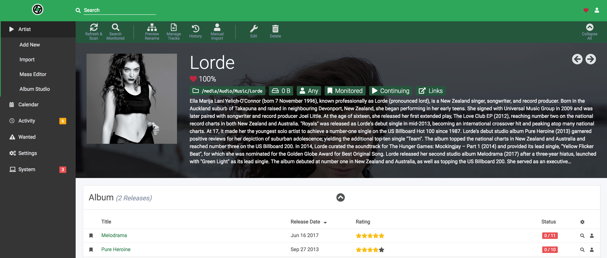

hero: AutoPirate - A fully-featured recipe to automate finding, downloading, and organising your media    

!!! warning
    This is not a complete recipe - it's a component of the [autopirate](https://geek-cookbook.funkypenguin.co.nz/recipes/autopirate/) "_uber-recipe_", but has been split into its own page to reduce complexity.

# Lidarr

[Lidarr](https://lidarr.audio/) is an automated music downloader for NZB and Torrent. It performs the same function as [Headphones](https://geek-cookbook.funkypenguin.co.nz/recipes/autopirate/headphones), but is written using the same(ish) codebase as [Radarr](https://geek-cookbook.funkypenguin.co.nz/recipes/autopirate/radarr/) and [Sonarr](https://geek-cookbook.funkypenguin.co.nz/recipes/autopirate/sonarr). It's blazingly fast, and includes beautiful album/artist art. Lidarr supports [SABnzbd](https://geek-cookbook.funkypenguin.co.nz/recipes/autopirate/sabnzbd/), [NZBGet](https://geek-cookbook.funkypenguin.co.nz/recipes/autopirate/nzbget/), Transmission, Torrent, Deluge and Blackhole (_just like Sonarr / Radarr_)



## Inclusion into AutoPirate

To include Lidarr in your [AutoPirate](https://geek-cookbook.funkypenguin.co.nz/recipes/autopirate/) stack, include the following in your autopirate.yml stack definition file:

```
lidarr:
  image: linuxserver/lidarr:latest
  env_file : /var/data/config/autopirate/lidarr.env
  volumes:
   - /var/data/autopirate/lidarr:/config
   - /var/data/media:/media
  networks:
  - internal

lidarr_proxy:
  image: a5huynh/oauth2_proxy
  env_file : /var/data/config/autopirate/lidarr.env
  networks:
    - internal
    - traefik_public
  deploy:
    labels:
      - traefik.frontend.rule=Host:lidarr.example.com
      - traefik.docker.network=traefik_public
      - traefik.port=4180
  volumes:
    - /var/data/config/autopirate/authenticated-emails.txt:/authenticated-emails.txt
  command: |
    -cookie-secure=false
    -upstream=http://lidarr:8181
    -redirect-url=https://lidarr.example.com
    -http-address=http://0.0.0.0:4180
    -email-domain=example.com
    -provider=github
    -authenticated-emails-file=/authenticated-emails.txt
```

!!! tip
    I share (_with my [patreon patrons](https://www.patreon.com/funkypenguin)_) a private "_premix_" git repository, which includes necessary docker-compose and env files for all published recipes. This means that patrons can launch any recipe with just a ```git pull``` and a ```docker stack deploy``` 

## Assemble more tools..

Continue through the list of tools below, adding whichever tools your want to use, and finishing with the **[end](https://geek-cookbook.funkypenguin.co.nz/recipes/autopirate/end/)** section:

* [SABnzbd](https://geek-cookbook.funkypenguin.co.nz/recipes/autopirate/sabnzbd.md)
* [NZBGet](https://geek-cookbook.funkypenguin.co.nz/recipes/autopirate/nzbget.md)
* [RTorrent](https://geek-cookbook.funkypenguin.co.nz/recipes/autopirate/rtorrent/)
* [Sonarr](https://geek-cookbook.funkypenguin.co.nz/recipes/autopirate/sonarr/)
* [Radarr](https://geek-cookbook.funkypenguin.co.nz/recipes/autopirate/radarr/)
* [Mylar](https://github.com/evilhero/mylar)
* [Lazy Librarian](https://geek-cookbook.funkypenguin.co.nz/recipes/autopirate/lazylibrarian/)
* [Headphones](https://geek-cookbook.funkypenguin.co.nz/recipes/autopirate/headphones/)
* Lidarr (this page)
* [NZBHydra](https://geek-cookbook.funkypenguin.co.nz/recipes/autopirate/nzbhydra/)
* [NZBHydra](https://geek-cookbook.funkypenguin.co.nz/recipes/autopirate/nzbhydra/)
* [NZBHydra2](https://geek-cookbook.funkypenguin.co.nz/recipes/autopirate/nzbhydra2/)
* [Ombi](https://geek-cookbook.funkypenguin.co.nz/recipes/autopirate/ombi/)
* [Jackett](https://geek-cookbook.funkypenguin.co.nz/recipes/autopirate/jackett/)
* [Heimdall](https://geek-cookbook.funkypenguin.co.nz/recipes/autopirate/heimdall/)
* [End](https://geek-cookbook.funkypenguin.co.nz/recipes/autopirate/end/) (launch the stack)


## Chef's Notes 

1. In many cases, tools will integrate with each other. I.e., Radarr needs to talk to SABnzbd and NZBHydra, Ombi needs to talk to Radarr, etc. Since each tool runs within the stack under its own name, just refer to each tool by name (i.e. "radarr"), and docker swarm will resolve the name to the appropriate container. You can identify the tool-specific port by looking at the docker-compose service definition.
2. The addition of the Lidarr recipe was contributed by our very own @gpulido in Discord (http://chat.funkypenguin.co.nz) - Thanks Gabriel!