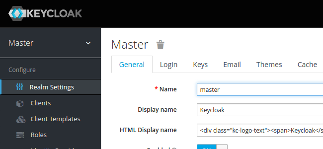

# KeyCloak

[KeyCloak](https://www.keycloak.org/) is "an open source identity and access management solution." Using a local database, or a variety of backends (_think [OpenLDAP](/recipes/openldap/)_), you can provide Single Sign-On (SSO) using OpenID, OAuth 2.0, and SAML.

!!! important
    Development of this recipe is sponsored by [The Common Observatory](https://www.observe.global/). Thanks guys!

    [](https://www.observe.global/)



## Ingredients

1. [Docker swarm cluster](/ha-docker-swarm/design/) with [persistent shared storage](/ha-docker-swarm/shared-storage-ceph.md)
2. [Traefik](/ha-docker-swarm/traefik_public) configured per design
3. DNS entry for the hostname (_i.e. "keycloak.your-domain.com"_) you intend to use for LDAP Account Manager, pointed to your [keepalived](ha-docker-swarm/keepalived/) IP

## Preparation

### Setup data locations

We'll need several directories to bind-mount into our container for both runtime and backup data, so create them as follows

```
mkdir -p /var/data/runtime/keycloak/database
mkdir -p /var/data/keycloak/database-dump
```

### Prepare environment

Create ```/var/data/keycloak/keycloak.env```, and populate with the following variables, customized for your own domain structure.

```
# Technically, this could be auto-detected, but we prefer to be prescriptive
DB_VENDOR=postgres
DB_DATABASE=keycloak
DB_ADDR=keycloak-db
DB_USER=keycloak
DB_PASSWORD=myuberpassword
KEYCLOAK_USER=admin
KEYCLOAK_PASSWORD=ilovepasswords

# This is required to run keycloak behind traefik
PROXY_ADDRESS_FORWARDING=true

# What's our hostname?
KEYCLOAK_HOSTNAME=keycloak.batcave.com

# Tell Postgress what user/password to create
POSTGRES_USER=keycloak
POSTGRES_PASSWORD=myuberpassword
```

Create /var/data/keycloak/keycloak-backup.env, and populate with the following, so that your database can be backed up to the filesystem, daily:

```
PGHOST=keycloak-db
PGUSER=keycloak
PGPASSWORD=myuberpassword
BACKUP_NUM_KEEP=7
BACKUP_FREQUENCY=1d
```

### Setup Docker Swarm

Create a docker swarm config file in docker-compose syntax (v3), something like this:

!!! tip
        I share (_with my [patreon patrons](https://www.patreon.com/funkypenguin)_) a private "_premix_" git repository, which includes necessary docker-compose and env files for all published recipes. This means that patrons can launch any recipe with just a ```git pull``` and a ```docker stack deploy``` 👍
```
version: '3'

services:
  keycloak:
    image: jboss/keycloak
    env_file: /var/data/config/keycloak/keycloak.env
    volumes:
      - /etc/localtime:/etc/localtime:ro    
    networks:
      - traefik_public
      - internal
    deploy:
      labels:
        - traefik.frontend.rule=Host:keycloak.batcave.com
        - traefik.port=8080
        - traefik.docker.network=traefik_public

  keycloak-db:
    env_file: /var/data/config/keycloak/keycloak.env
    image: postgres:10.1
    volumes:
      - /var/data/runtime/keycloak/database:/var/lib/postgresql/data
      - /etc/localtime:/etc/localtime:ro    
    networks:
      - internal

  keycloak-db-backup:
    image: postgres:10.1
    env_file: /var/data/config/keycloak/keycloak-backup.env
    volumes:
      - /var/data/keycloak/database-dump:/dump
      - /etc/localtime:/etc/localtime:ro
    entrypoint: |
      bash -c 'bash -s <<EOF
      trap "break;exit" SIGHUP SIGINT SIGTERM
      sleep 2m
      while /bin/true; do
        pg_dump -Fc > /dump/dump_\`date +%d-%m-%Y"_"%H_%M_%S\`.psql
        (ls -t /dump/dump*.psql|head -n $$BACKUP_NUM_KEEP;ls /dump/dump*.psql)|sort|uniq -u|xargs rm -- {}
        sleep $$BACKUP_FREQUENCY
      done
      EOF'
    networks:
      - internal

networks:
  traefik_public:
    external: true
  internal:
    driver: overlay
    ipam:
      config:
        - subnet: 172.16.49.0/24    
```

!!! note
    Setup unique static subnets for every stack you deploy. This avoids IP/gateway conflicts which can otherwise occur when you're creating/removing stacks a lot. See [my list](/reference/networks/) here.


## Serving

### Launch KeyCloak stack

Launch the KeyCloak stack by running ```docker stack deploy keycloak -c <path -to-docker-compose.yml>```

Log into your new instance at https://**YOUR-FQDN**, and login with the user/password you defined in keycloak.env.

### Integrating into OpenLDAP

KeyCloak gets really sexy when you integrate it into your [OpenLDAP](/recipes/openldap/) stack (_also, it's great not to have to play with ugly LDAP tree UIs_).

You'll need to have completed the [OpenLDAP](/recipes/openldap/) recipe

You start in the "Master" realm - but mouseover the realm name, to a dropdown box allowing you add an new realm:


Enter a name for your new realm, and click "_Create_":


Once in the desired realm, click on **User Federation**, and click **Add Provider**. On the next page ("_Required Settings_"), set the following:

* **Edit Mode** : Writeable
* **Vendor** : Other
* **Connection URL** : ldap://openldap
* **Users DN** : ou=People,<your base DN\>
* **Authentication Type** : simple
* **Bind DN** : cn=admin,<your base DN\>
* **Bind Credential** : <your chosen admin password\>

Save your changes, and then navigate back to "User Federation" > Your LDAP name > Mappers:


For each of the following mappers, click the name, and set the "_Read Only_" flag to "_Off_" (_this enables 2-way sync between KeyCloak and OpenLDAP_)

* last name
* username
* email
* first name


!!! important
    Development of the original KeyCloak recipe is sponsored by [The Common Observatory](https://www.observe.global/). Thanks guys!

    [](https://www.observe.global/)


## Chef's Notes

### Tip your waiter (support me) 👏

Did you receive excellent service? Want to make your waiter happy? (_..and support development of current and future recipes!_) See the [support](/support/) page for (_free or paid)_ ways to say thank you! 👏

### Your comments? 💬
