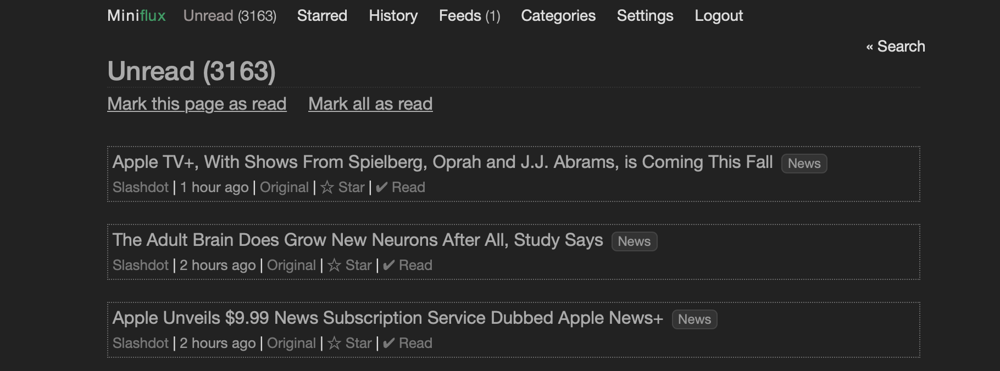

hero: Miniflux - A recipe for a lightweight minimalist RSS reader

# Miniflux

Miniflux is a lightweight RSS reader, developed by [Frédéric Guillot](https://github.com/fguillot). (_Who also happens to be the developer of the favorite Open Source Kanban app, [Kanboard](/recipes/kanboard/)_)



!!! tip "Sponsored Project"
    Miniflux is one of my [sponsored projects](/sponsored-projects/) - a project I financially support on a regular basis because of its utility to me. Although I get to process my RSS feeds less frequently than I'd like to!

I've [reviewed Miniflux in detail on my blog](https://www.funkypenguin.co.nz/review/miniflux-lightweight-self-hosted-rss-reader/), but features (among many) that I appreciate:

* Compatible with the Fever API, read your feeds through existing mobile and desktop clients (_This is the killer feature for me. I hardly ever read RSS on my desktop, I typically read on my iPhone or iPad, using [Fiery Feeds](http://cocoacake.net/apps/fiery/) or my new squeeze, [Unread](https://www.goldenhillsoftware.com/unread/)_)
* Send your bookmarks to Pinboard, Wallabag, Shaarli or Instapaper (_I use this to automatically pin my bookmarks for collection on my [blog](https://www.funkypenguin.co.nz/blog/)_)
* Feeds can be configured to download a "full" version of the content (_rather than an excerpt_)
* Use the Bookmarklet to subscribe to a website directly from any browsers

!!! abstract "2.0+ is a bit different"
    [Some things changed](https://docs.miniflux.net/en/latest/migration.html) when Miniflux 2.0 was released. For one thing, the only supported database is now postgresql (_no more SQLite_). External themes are gone, as is PHP (_in favor of golang_). It's been a controversial change, but I'm keen on minimal and single-purpose, so I'm still very happy with the direction of development. The developer has laid out his [opinions](https://docs.miniflux.net/en/latest/opinionated.html) re the decisions he's made in the course of development.

## Ingredients

1. [Docker swarm cluster](/ha-docker-swarm/design/) with [persistent shared storage](/ha-docker-swarm/shared-storage-ceph.md)
2. [Traefik](/ha-docker-swarm/traefik) configured per design
3. DNS entry pointing your Miniflux url (i.e. _miniflux.example.com_) to your [keepalived](ha-docker-swarm/keepalived/) IP

## Preparation

### Setup data locations

Create the location for the bind-mount of the application data, so that it's persistent:

```
mkdir -p /var/data/miniflux/database-dump
mkdir -p /var/data/runtime/miniflux/database

```

### Setup environment

Create ```/var/data/config/miniflux/miniflux.env``` something like this:

```
DATABASE_URL=postgres://miniflux:secret@db/miniflux?sslmode=disable
POSTGRES_USER=miniflux
POSTGRES_PASSWORD=secret

# This is necessary for the miniflux to update the db schema, even on an empty DB
RUN_MIGRATIONS=1

# Uncomment this on first run, else leave it commented out after adding your own user account
CREATE_ADMIN=1
ADMIN_USERNAME=admin
ADMIN_PASSWORD=test1234

# For backups
PGUSER=miniflux
PGPASSWORD=secret
PGHOST=db
BACKUP_NUM_KEEP=7
BACKUP_FREQUENCY=1d
```

The entire application is configured using environment variables, including the initial username. Once you've successfully deployed once, comment out ```CREATE_ADMIN``` and the two successive lines.

### Setup Docker Swarm

Create a docker swarm config file in docker-compose syntax (v3), something like this:

!!! tip
        I share (_with my [patreon patrons](https://www.patreon.com/funkypenguin)_) a private "_premix_" git repository, which includes necessary docker-compose and env files for all published recipes. This means that patrons can launch any recipe with just a ```git pull``` and a ```docker stack deploy``` 👍

```
version: '3'

services:
  miniflux:
    image: miniflux/miniflux:2.0.7
    env_file: /var/data/config/miniflux/miniflux.env
    volumes:
     - /etc/localtime:/etc/localtime:ro
    networks:
    - internal
    - traefik_public
    deploy:
      labels:
        - traefik.frontend.rule=Host:miniflux.example.com
        - traefik.port=8080
        - traefik.docker.network=traefik_public

  db:
    env_file: /var/data/config/miniflux/miniflux.env
    image: postgres:10.1
    volumes:
      - /var/data/runtime/miniflux/database:/var/lib/postgresql/data
      - /etc/localtime:/etc/localtime:ro
    networks:
      - internal

  db-backup:
    image: postgres:10.1
    env_file: /var/data/config/miniflux/miniflux.env
    volumes:
      - /var/data/miniflux/database-dump:/dump
      - /etc/localtime:/etc/localtime:ro
    entrypoint: |
      bash -c 'bash -s <<EOF
      trap "break;exit" SIGHUP SIGINT SIGTERM
      sleep 2m
      while /bin/true; do
        pg_dump -Fc > /dump/dump_\`date +%d-%m-%Y"_"%H_%M_%S\`.psql
        (ls -t /dump/dump*.psql|head -n $$BACKUP_NUM_KEEP;ls /dump/dump*.psql)|sort|uniq -u|xargs rm -- {}
        sleep $$BACKUP_FREQUENCY
      done
      EOF'
    networks:
    - internal

networks:
  traefik_public:
    external: true
  internal:
    driver: overlay
    ipam:
      config:
        - subnet: 172.16.22.0/24
```


## Serving

### Launch Miniflux stack

Launch the Miniflux stack by running ```docker stack deploy miniflux -c <path -to-docker-compose.yml>```

Log into your new instance at https://**YOUR-FQDN**, using the credentials you setup in the environment flie. After this, change your user/password as you see fit, and comment out the ```CREATE_ADMIN``` line in the env file (_if you don't, then an **additional** admin will be created the next time you deploy_)

## Chef's Notes

1. Find the bookmarklet under the **Settings -> Integration** page.

### Tip your waiter (support me) 👏

Did you receive excellent service? Want to make your waiter happy? (_..and support development of current and future recipes!_) See the [support](/support/) page for (_free or paid)_ ways to say thank you! 👏

### Your comments? 💬
