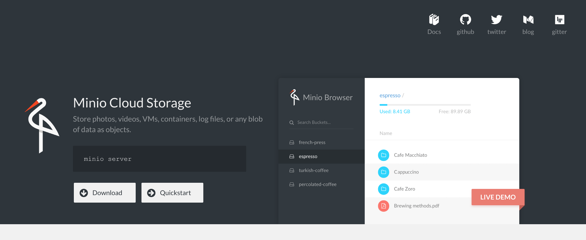

# Minio

Minio is a high performance distributed object storage server, designed for
large-scale private cloud infrastructure.

However, at its simplest, Minio allows you to expose a local filestructure via the [Amazon S3 API](https://docs.aws.amazon.com/AmazonS3/latest/API/Welcome.html). You could, for example, use it to provide access to "buckets" (folders) of data on your filestore, secured by access/secret keys, just like AWS S3. You can further interact with your "buckets" with common tools, just as if they were hosted on S3.

Under a more advanced configuration, Minio runs in distributed mode, with [features](https://www.minio.io/features.html) including high-availability, mirroring, erasure-coding, and "bitrot detection".



Possible use-cases:

1. Sharing files (_protected by user accounts with secrets_) via HTTPS, either as read-only or read-write, in such a way that the bucket could be mounted to a remote filesystem using common S3-compatible tools, like [goofys](https://github.com/kahing/goofys). Ever wanted to share a folder with friends, but didn't want to open additional firewall ports etc?
2. Simulating S3 in a dev environment
3. Mirroring an S3 bucket locally

## Ingredients

1. [Docker swarm cluster](https://geek-cookbook.funkypenguin.co.nz/)ha-docker-swarm/design/) with [persistent shared storage](https://geek-cookbook.funkypenguin.co.nz/)ha-docker-swarm/shared-storage-ceph.md)
2. [Traefik](https://geek-cookbook.funkypenguin.co.nz/)ha-docker-swarm/traefik_public) configured per design
3. DNS entry for the hostname you intend to use, pointed to your [keepalived](ha-docker-swarm/keepalived/) IP

## Preparation

### Setup data locations

We'll need a directory to hold our minio file store, as well as our minio client config, so create a structure at /var/data/minio:

```
mkdir /var/data/minio
cd /var/data/minio
mkdir -p {mc,data}
```

### Prepare environment

Create minio.env, and populate with the following variables
```
MINIO_ACCESS_KEY=<some random, complex string>
MINIO_SECRET_KEY=<another random, complex string>
```

### Setup Docker Swarm

Create a docker swarm config file in docker-compose syntax (v3), something like this:

!!! tip
        I share (_with my [patreon patrons](https://www.patreon.com/funkypenguin)_) a private "_premix_" git repository, which includes necessary docker-compose and env files for all published recipes. This means that patrons can launch any recipe with just a ```git pull``` and a ```docker stack deploy``` 


```
version: '3.1'

services:
  app:
    image: minio/minio
    env_file: /var/data/config/minio/minio.env
    volumes:
     - /var/data/minio/data:/data
    networks:
      - traefik_public
    deploy:
      labels:
        - traefik.frontend.rule=Host:minio.example.com
        - traefik.port=9000
    command:  minio server /data

networks:
  traefik_public:
    external: true
```

## Serving

### Launch Minio stack

Launch the Minio stack by running ```docker stack deploy minio -c <path -to-docker-compose.yml>```

Log into your new instance at https://**YOUR-FQDN**, with the access key and secret key you specified in minio.env.

If you created ```/var/data/minio```, you'll see nothing. If you referenced existing data, you should see all subdirectories in your existing folder represented as buckets.

If all you need is single-user access to your data, you're done! 🎉

If, however, you want to expose data to multiple users, at different privilege levels, you'll need the minio client to create some users and (_potentially_) policies...

### Setup minio client

To administer the Minio server, we need the Minio client. While it's possible to download the minio client and run it locally, it's just as easy to do it within a small (5Mb) container.

I created an alias on my docker nodes, allowing me to run mc quickly:

```
alias mc='docker run -it -v /docker/minio/mc/:/root/.mc/ --network traefik_public minio/mc'
```

Now I use the alias to launch the client shell, and connect to my minio instance (_I could also use the external, traefik-provided URL_)

```
root@ds1:~# mc config host add minio http://app:9000 admin iambatman
mc: Configuration written to `/root/.mc/config.json`. Please update your access credentials.
mc: Successfully created `/root/.mc/share`.
mc: Initialized share uploads `/root/.mc/share/uploads.json` file.
mc: Initialized share downloads `/root/.mc/share/downloads.json` file.
Added `minio` successfully.
root@ds1:~#
```

### Add (readonly) user

Use mc to add a (readonly or readwrite) user, by running ``` mc admin user add minio <access key> <secret key> <access level>```

Example:

```
root@ds1:~# mc admin user add minio spiderman peterparker readonly
Added user `spiderman` successfully.
root@ds1:~#
```

Confirm by listing your users (_admin is excluded from the list_):

```
root@node1:~# mc admin user list minio
enabled    spiderman             readonly
root@node1:~#
```

### Make a bucket accessible to users

By default, all buckets have no "policies" attached to them, and so can only be accessed by the administrative user. Having created some readonly/read-write users above, you'll be wanting to grant them access to buckets.

The simplest permission scheme is "on or off". Either a bucket has a policy, or it doesn't. (_I believe you can apply policies to subdirectories of buckets in a more advanced configuration_)

After **no** policy, the most restrictive policy you can attach to a bucket is "download". This policy will allow authenticated users to download contents from the bucket. Apply the "download" policy to a bucket by running ```mc policy download minio/<bucket name>```, i.e.:

```
root@ds1:# mc policy download minio/comics
Access permission for `minio/comics` is set to `download`
root@ds1:#
```

### Advanced bucketing

There are some clever complexities you can achieve with user/bucket policies, including:

* A public bucket, which requires no authentication to read or even write (_for a public dropbox, for example_)
* A special bucket, hidden from most users, but available to VIP users by application of a custom "[canned policy](https://docs.minio.io/docs/minio-multi-user-quickstart-guide.html)"

### Mount a minio share remotely

Having setup your buckets, users, and policies - you can give out your minio external URL, and user access keys to your remote users, and they can S3-mount your buckets, interacting with them based on their user policy (_read-only or read/write_)

I tested the S3 mount using [goofys](https://github.com/kahing/goofys), "a high-performance, POSIX-ish Amazon S3 file system written in Go".

First, I created ~/.aws/credentials, as follows:

```
[default]
aws_access_key_id=spiderman
aws_secret_access_key=peterparker
```

And then I ran (_in the foreground, for debugging_), ```goofys --f -debug_s3 --debug_fuse --endpoint=https://traefik.example.com <bucketname> <local mount point>```

To permanently mount an S3 bucket using goofys, I'd add something like this to /etc/fstab:

```
goofys#bucket   /mnt/mountpoint        fuse     _netdev,allow_other,--file-mode=0666    0       0
```

## Chef's Notes 📓

1. There are many S3-filesystem-mounting tools available, I just picked Goofys because it's simple. Google is your friend :)
2. Some applications (_like [NextCloud](https://geek-cookbook.funkypenguin.co.nz/)recipes/nextcloud/)_) can natively mount S3 buckets
3. Some backup tools (_like [Duplicity](https://geek-cookbook.funkypenguin.co.nz/)recipes/duplicity/)_) can backup directly to S3 buckets

