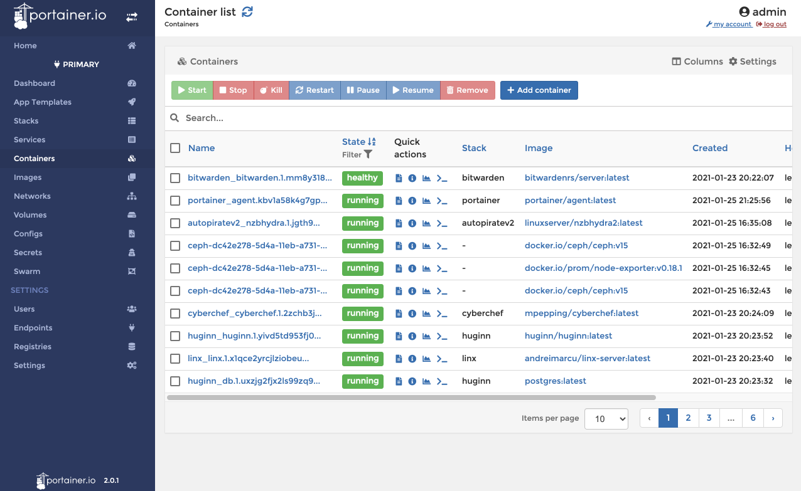

hero: A recipe for a sexy view of your Docker Swarm

# Portainer

[Portainer](https://portainer.io/) is a lightweight sexy UI for visualizing your docker environment. It also happens to integrate well with Docker Swarm clusters, which makes it a great fit for our stack.



## Ingredients

1. [Docker swarm cluster](/ha-docker-swarm/design/) with [persistent shared storage](/ha-docker-swarm/shared-storage-ceph.md)
2. [Traefik](/ha-docker-swarm/traefik) configured per design
3. DNS entry for the hostname you intend to use, pointed to your [keepalived](/ha-docker-swarm/keepalived/) IP

## Preparation

### Setup data locations

Create a folder to store portainer's persistent data:

```
mkdir /var/data/portainer
```

### Setup Docker Swarm

Create a docker swarm config file in docker-compose syntax (v3), something like this:

--8<-- "premix-cta.md"

```
version: "3"

services:
  portainer:
    image: portainer/portainer-ce
    env_file: /var/data/config/portainer/portainer.env
    volumes:
      - /var/data/portainer:/data
    networks:
      - traefik_public
      - internal
    deploy:
      replicas: 1
      labels:
        # traefik
        - traefik.enable=true
        - traefik.docker.network=traefik_public

        # traefikv1
        - traefik.frontend.rule=Host:portainer.example.com
        - traefik.port=9000    
        # uncomment if you want to protect portainer with traefik-forward-auth using traefikv1 
        # - traefik.frontend.auth.forward.address=http://traefik-forward-auth:4181
        # - traefik.frontend.auth.forward.authResponseHeaders=X-Forwarded-User
        # - traefik.frontend.auth.forward.trustForwardHeader=true        

        # traefikv2
        - "traefik.http.routers.portainer.rule=Host(`portainer.example.com`)"
        - "traefik.http.routers.portainer.entrypoints=https"
        - "traefik.http.services.portainer.loadbalancer.server.port=9000"
        # uncomment if you want to protect portainer with traefik-forward-auth using traefikv2         
        # - "traefik.http.routers.portainer.middlewares=forward-auth"
      placement:
        constraints: [node.role == manager]                                                   
    command: -H "tcp://tasks.portainer_agent:9001" --tlsskipverify

  agent:
    image: portainer/agent
    environment:
      AGENT_CLUSTER_ADDR: tasks.portainer_agent
      CAP_HOST_MANAGEMENT: 1
    volumes:
      - /var/run/docker.sock:/var/run/docker.sock
      - /var/lib/docker/volumes:/var/lib/docker/volumes
    ports:
      - target: 9001
        published: 9001
        protocol: tcp
        mode: host
    networks:
      - internal
    deploy:
      mode: global
      placement:
        constraints: [node.platform.os == linux]

networks:
  traefik_public:
    external: true
```

## Serving

### Launch Portainer stack

Launch the Portainer stack by running ```docker stack deploy portainer -c <path -to-docker-compose.yml>```

Log into your new instance at https://**YOUR-FQDN**. You'll be prompted to set your admin user/password.

[^1]: I wanted to use oauth2_proxy to provide an additional layer of security for Portainer, but the proxy seems to break the authentication mechanism, effectively making the stack **so** secure, that it can't be logged into!

--8<-- "recipe-footer.md"